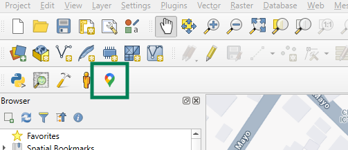

# Open Google Maps QGIS Plugin

## Overview

A QGIS plugin that allows users to quickly open the current map view in Google Maps with a single click, maintaining the approximate zoom and centre point.

## Features

- Transforms current QGIS map view to Google Maps
- Preserves approximate zoom level
- Simple toolbar button interface

## Installation

### QGIS Plugin Manager (Coming Soon)

1. Open QGIS
2. Go to Plugins > Manage and Install Plugins
3. Search for "Open in Google Maps"
4. Click "Install Plugin"

### Manual Installation

1. Download the latest release
2. Copy the plugin folder to:
   - Windows: `C:\Users\[USERNAME]\.qgis3\python\plugins\`
   - Mac/Linux: `~/.qgis3/python/plugins/`

## Usage

1. Open your map in QGIS
2. Click the "Open in Google Maps" toolbar icon
3. Your current map view will open in your default web browser

## Requirements

- QGIS 3.0+
- Python 3.6+
- Internet connection

## Compatibility

- Tested on QGIS 3.22
- Tested on Windows 11
- Tested on macOS 15 Sequoia

## License

GNU General Public License v3.0

## Author

Harry King
